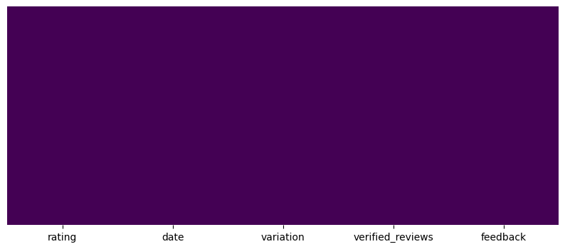
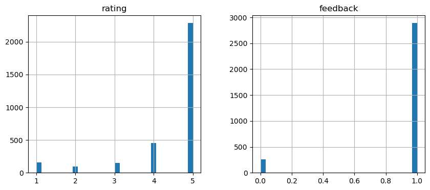
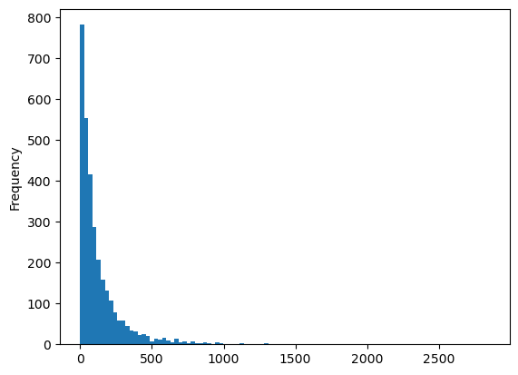
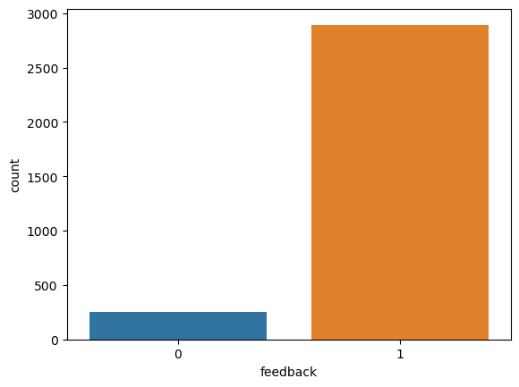
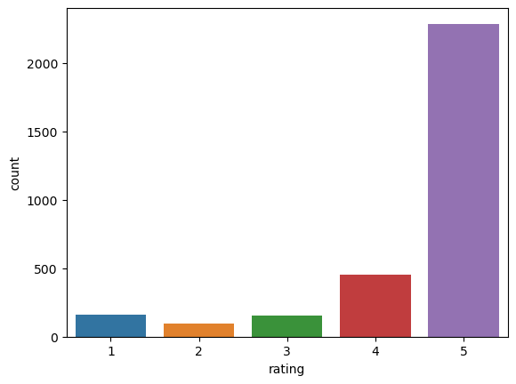
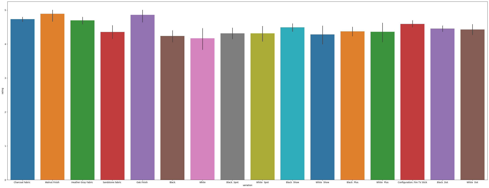
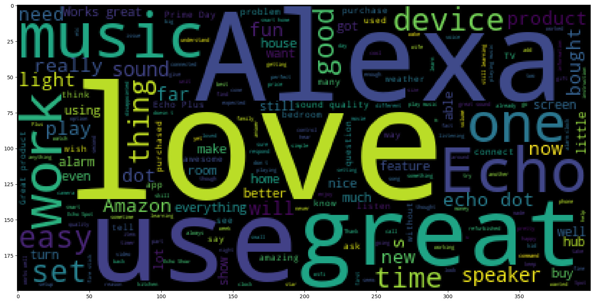
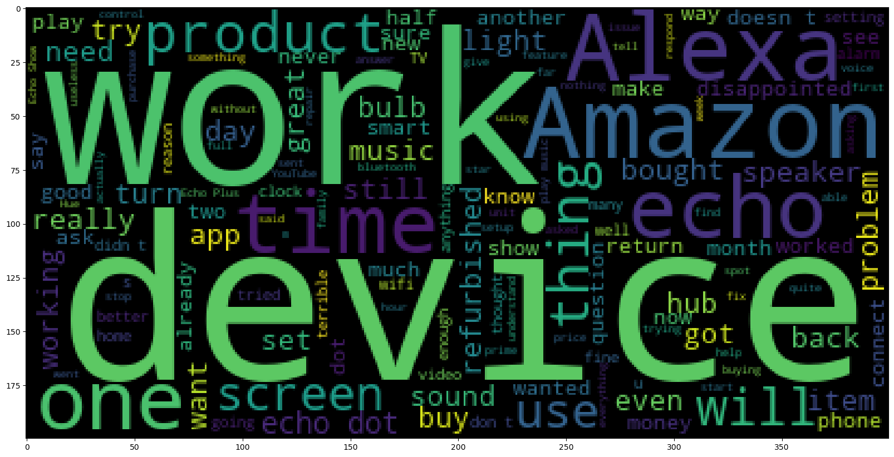
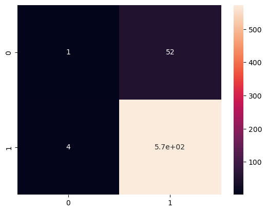

# 📦 Amazon Alexa Review Sentiment NLP Project

> Classifying Amazon Alexa customer reviews as Positive or Negative using NLP — comparing Naive Bayes vs Logistic Regression.


---

## 📖 Overview

Amazon Alexa is one of the world's most popular smart speakers. Every day, thousands of customers leave written reviews about their experience. Hidden inside these reviews is incredibly valuable feedback — what customers love, what frustrated them, and how they truly feel.

> 💭 *"Can a machine learning model read a customer's written review and automatically decide if it's positive or negative?"*

This project builds a full **NLP text classification pipeline** to answer that — using real Amazon Alexa verified customer reviews, and comparing two models: **Naive Bayes** and **Logistic Regression**.

---

## 📁 Project Structure

```
📦 Amazon-Alexa-Review-Sentiment-NLP
 ┣ 📓 Amazon_Alexa_Review_Sentiment_NLP.ipynb   # Main notebook
 ┣ 📄 amazon_alexa.tsv                          # Dataset (TSV format)
 ┣ 🖼️ images/                                   # Plots used in this README
 ┗ 📘 README.md                                 # Project overview
```

---

## 🎯 Objective

| Goal | Description |
|------|-------------|
| 🔍 Explore | Analyze review lengths, rating distributions and word patterns |
| 🧹 Clean | Remove punctuation and stopwords from raw review text |
| 🔤 Vectorize | Convert cleaned text into numeric word count features |
| 🤖 Model | Train a Naive Bayes classifier on word count features |
| 📊 Evaluate | Measure accuracy, precision and recall |
| 🔁 Compare | Train a Logistic Regression model and compare results |

---

## 🗂️ Dataset

3,150 Amazon Alexa verified customer reviews:

| Column | Description |
|--------|-------------|
| `rating` | Star rating given (1–5) |
| `date` | Date of the review |
| `variation` | Alexa product variant reviewed (e.g. Black Dot, White Dot) |
| 📝 `verified_reviews` | Full written review — **main feature** |
| 🎯 `feedback` | **Target** — 1 = Positive, 0 = Negative |

---

## 🧠 Skills Used

- 🐍 Python
- 🐼 Pandas & NumPy — data manipulation
- 📊 Matplotlib & Seaborn — data visualization
- ☁️ WordCloud — visualizing most common words
- 🔤 Scikit-learn `CountVectorizer` — Bag-of-Words text vectorization
- 🧹 NLTK — stopword removal
- 🤖 Scikit-learn `MultinomialNB` — Naive Bayes classifier
- 📈 Scikit-learn `LogisticRegression` — comparison model
- 🧮 Model evaluation — Confusion Matrix, Precision, Recall, F1-score
- 📓 Jupyter Notebook

---

## 🚀 Project Workflow

```
📥 Load Data → 🔎 EDA → 🧹 Clean Text → 🔤 CountVectorize → 🤖 Naive Bayes → 📏 Evaluate → 📈 Logistic Regression → ⚖️ Compare
```

---

## 🔎 Exploratory Data Analysis

### 🌡️ Missing Values Heatmap
Checking which columns have missing data before doing anything else.



### 📊 Feature Distributions
Histogram of all numeric columns — ratings, feedback, and review lengths at a glance.



### 📏 Review Length Distribution
How long are the reviews? Are most reviews short or do customers write detailed feedback?



### 📊 Positive vs Negative Reviews
A clear picture of the class imbalance — the vast majority of Alexa reviews are positive.



### ⭐ Star Rating Distribution
How are ratings spread across 1–5 stars? This confirms most customers are happy with Alexa.



### 📦 Average Rating per Product Variation
Which Alexa variants (Black Dot, White Plus, etc.) get the highest ratings?



### ☁️ Word Cloud — All Reviews
The most frequently used words across all 3,150 reviews — love, great, easy, and music dominate.



### ☁️ Word Cloud — Negative Reviews Only
The most common words in 1-star and negative reviews — return, problem, and disappointed stand out.



---

## 🧹 Text Cleaning Pipeline

Raw reviews are cleaned using a custom `message_cleaning` function before vectorization:

```python
def message_cleaning(message):
    # Step 1: Remove all punctuation characters
    Test_punc_removed = [char for char in message if char not in string.punctuation]
    Test_punc_removed_join = ''.join(Test_punc_removed)
    # Step 2: Remove stopwords (the, and, is, it...)
    Test_punc_removed_join_clean = [word for word in Test_punc_removed_join.split()
                                    if word.lower() not in stopwords.words('english')]
    return Test_punc_removed_join_clean
```

Then `CountVectorizer(analyzer=message_cleaning)` converts each cleaned review into a vector of **5,211 word count features** — one column per unique word in the dataset.

---

## 🤖 Model 1 — Naive Bayes

### 📊 Training Confusion Matrix
How well did the model learn from the training data?

### 📊 Test Confusion Matrix
How well does it perform on unseen reviews?


| Metric | Negative (0) | Positive (1) |
|--------|:-----------:|:------------:|
| Precision | 0.18 | 0.92 |
| Recall | 0.06 | 0.98 |
| F1-score | 0.09 | 0.95 |

**Accuracy: ~90%**

---

## 📈 Model 2 — Logistic Regression

### 📊 Confusion Matrix



| Metric | Negative (0) | Positive (1) |
|--------|:-----------:|:------------:|
| Precision | 0.20 | 0.92 |
| Recall | 0.02 | 0.99 |
| F1-score | 0.03 | 0.95 |

**Accuracy: ~91%**

---

## 💡 Model Comparison

| Model | Accuracy | Negative F1 | Positive F1 |
|-------|:--------:|:-----------:|:-----------:|
| 🤖 Naive Bayes | 90% | 0.09 | 0.95 |
| 📈 Logistic Regression | **91%** | 0.03 | **0.95** |

Logistic Regression achieved the highest accuracy (91%), while Naive Bayes detected negative reviews slightly better. Overall, both models performed well on positive reviews but struggled with negative reviews because the dataset is highly imbalanced (~91% positive reviews).

---

## 💡 Conclusion

🏆 **Key takeaways:**
- The dataset is heavily skewed toward positive reviews — models naturally learn to predict "positive" most of the time
- Word clouds provided real business insight — words like *"return"* and *"problem"* clearly dominate negative reviews
- Removing punctuation and stopwords before vectorizing cleaned up noise and gave stronger word count features
- CountVectorizer with a custom cleaning function is a powerful, lightweight NLP pipeline
- Logistic Regression slightly outperformed Naive Bayes overall, but both struggle equally with the minority negative class

📌 **Real-world value:** An automated sentiment classifier like this could be used by Amazon's product team to instantly flag negative reviews for quality control — without reading thousands of reviews manually.

---

## 📦 How to Run This Project

```bash
# Clone the repo
git clone https://github.com/dktamta/Amazon-Alexa-Review-Sentiment-NLP.git
cd Amazon-Alexa-Review-Sentiment-NLP

# Install dependencies
pip install pandas numpy matplotlib seaborn scikit-learn nltk wordcloud jupyter

# Launch the notebook
jupyter notebook Amazon-Alexa-Review-Sentiment-NLP.ipynb
```

---

## 🌟 What I Learned

- 🔤 Building a custom text cleaning pipeline (punctuation + stopword removal)
- 📐 Converting raw text to numeric features using Bag-of-Words (CountVectorizer)
- 🤖 Training and evaluating a Multinomial Naive Bayes text classifier
- 📈 Comparing Naive Bayes against Logistic Regression on imbalanced NLP data
- ☁️ Using Word Clouds to extract real business insight from raw text
- 🧮 Understanding why class imbalance hurts recall on minority classes

---

## 🙌 Acknowledgements

Dataset: Amazon Alexa product reviews — collected from verified Amazon purchases.

---

## 👤 Author

**Deepak Kumar Tamta**

🧑‍💻 Data Scientist

🔗 [LinkedIn](https://www.linkedin.com/in/deepak-tamta/)

🐙 [GitHub](https://github.com/dktamta/)

---
